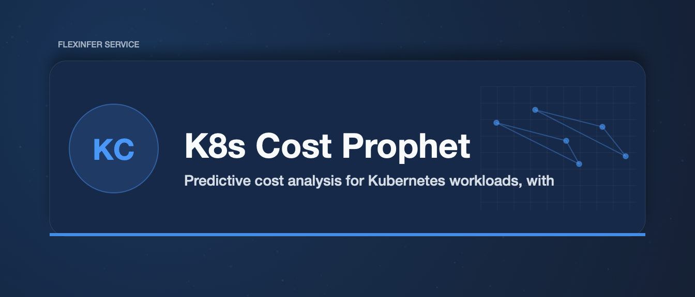

# K8s Cost Prophet

Predictive cost analysis for Kubernetes workloads, with special focus on GPU/AI workloads.

## Overview

Before deploying AI workloads, know what they'll cost. K8s Cost Prophet:

- **Analyzes Manifests**: Parse Kustomize/Helm and calculate resource costs
- **Historical Patterns**: Learn from Prometheus metrics
- **GPU Pricing**: Model GPU hour costs for inference workloads
- **What-If Scenarios**: Explore scaling options

## Features

- **Manifest Analysis**: Parse K8s YAML, Kustomize, and Helm charts
- **Resource Calculation**: CPU, memory, GPU, storage costs
- **Prometheus Integration**: Historical usage for better estimates
- **Cost Models**: Cloud pricing, on-prem depreciation, electricity
- **Alerts**: Cost anomaly detection
- **MCP Tool**: Query costs from coding agents

## Installation

```bash
go install gitlab.flexinfer.ai/services/k8s-cost-prophet/cmd/prophet@latest
```

## Usage

### Analyze Manifests

```bash
# Single manifest
prophet analyze deployment.yaml

# Kustomize directory
prophet analyze --kustomize ./k3s/apps/myapp

# Helm chart
prophet analyze --helm ./charts/myapp --values values.yaml

# All manifests in directory
prophet analyze ./k3s/apps/
```

### Cost Report

```bash
# Monthly cost estimate
prophet report --period month

# With Prometheus data for historical patterns
prophet report --prometheus http://prometheus:9090 --period month

# Breakdown by namespace
prophet report --by namespace
```

### What-If Analysis

```bash
# Scale up scenario
prophet whatif --scale myapp=10 --namespace production

# GPU upgrade scenario
prophet whatif --gpu-type a100 --replicas 2

# Spot/preemptible pricing
prophet whatif --spot-fraction 0.5
```

### MCP Server

```bash
# Expose as MCP server
prophet mcp-serve --port 8089
```

**Available Tools:**
- `cost/analyze` - Analyze manifest costs
- `cost/report` - Generate cost report
- `cost/whatif` - What-if scenario analysis

## Configuration

```yaml
# .cost-prophet.yaml
pricing:
  # Cloud pricing model
  model: custom  # aws, gcp, azure, custom

  # Custom hourly rates
  cpu_hour: 0.05      # per vCPU hour
  memory_gb_hour: 0.01
  storage_gb_month: 0.10

  # GPU pricing
  gpus:
    nvidia-a100: 3.00  # per GPU hour
    nvidia-v100: 1.50
    amd-7900xtx: 0.50  # homelab

  # On-prem factors
  electricity_kwh: 0.12
  depreciation_years: 3

prometheus:
  url: http://prometheus:9090
  metrics:
    cpu: container_cpu_usage_seconds_total
    memory: container_memory_working_set_bytes
    gpu: DCGM_FI_DEV_GPU_UTIL

thresholds:
  warn_monthly: 100     # Alert if monthly > $100
  warn_increase: 20     # Alert if >20% increase

namespaces:
  exclude:
    - kube-system
    - monitoring
```

## Cost Models

### Cloud

Uses published pricing:
- AWS EKS pricing
- GCP GKE pricing
- Azure AKS pricing

### On-Premises (Homelab)

Factors in:
- Hardware depreciation
- Electricity costs
- Cooling overhead (PUE)
- GPU power consumption

### GPU Workloads

Special handling for:
- vLLM inference servers
- ComfyUI rendering
- Training jobs

## Output Formats

### Summary

```
Namespace: ai
Total Monthly Cost: $247.50

  vllm-deployment      $180.00 (GPU: 1x AMD-7900XTX)
  embedding-service     $45.00 (CPU: 2, Memory: 8Gi)
  whisper-service       $22.50 (GPU: 0.5x AMD-7900XTX)
```

### JSON

```json
{
  "period": "month",
  "total_cost": 247.50,
  "by_namespace": {
    "ai": {
      "cost": 247.50,
      "workloads": [...]
    }
  }
}
```

### Prometheus Metrics

```
k8s_cost_monthly_total{namespace="ai"} 247.50
k8s_cost_cpu_hours{namespace="ai",deployment="vllm"} 720
k8s_cost_gpu_hours{namespace="ai",deployment="vllm"} 720
```

## Integration with flexinfer

Works with flexinfer's GPU scheduling:
- Reads ModelDeployment CRDs
- Understands model caching
- Factors in standby vs active costs

```bash
prophet analyze --flexinfer
```

## Development

```bash
# Build
make build

# Test
make test

# Run example
make example
```

## Architecture

```
cmd/prophet/main.go      # CLI entrypoint
internal/
  analyzer/              # Manifest parsing
  calculator/            # Cost calculations
  reporter/              # Output formatting
pkg/types/               # Shared types
```

## License

MIT
